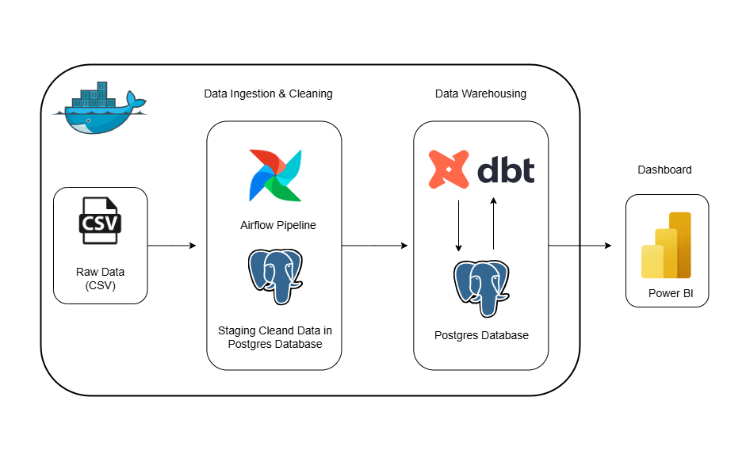
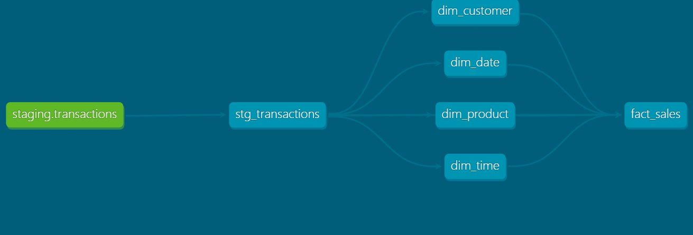
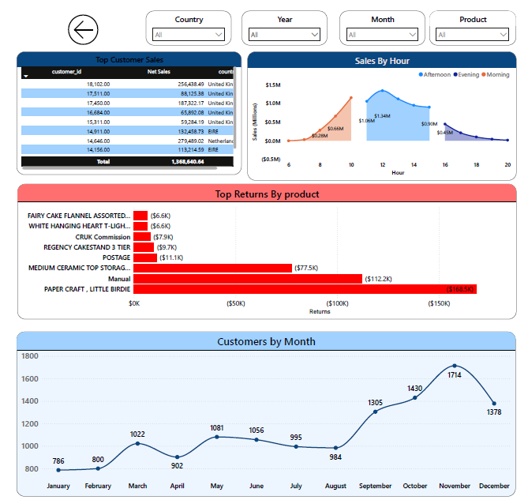

# 🛍️ E-Commerce Sales Data Pipeline

  
*Figure 1: End-to-End Data Pipeline Workflow*

---

## 📌 Project Overview
This project builds a complete **end-to-end data pipeline** for e-commerce sales data.  
It covers every step of the data engineering lifecycle:
- Ingesting raw sales transactions
- Transforming and modeling data
- Building a **data warehouse**
- Delivering **analytics dashboards** for insights

The pipeline is designed to handle large volumes of data efficiently and provide a single source of truth for analytics.

---

## ⚙️ Tech Stack & Tools
- **Airflow** → Orchestration of data workflows  
- **PostgreSQL** → Central database for storing raw + transformed data  
- **Docker & Docker-Compose** → Containerization for reproducibility  
- **dbt (Data Build Tool)** → Data modeling and transformations (star schema)  
- **Looker Studio / Power BI** → Dashboarding and reporting  

---

## 🗂️ Pipeline Workflow
1. **Extract & Load**: Load raw CSV/transactional sales data into PostgreSQL using Airflow.  
2. **Transform**: Clean and standardize data (e.g., date formats, handling missing values).
  
3. **Data Warehouse with dbt**:
   - Built **star schema** with **Fact Table** (sales) and **Dimension Tables** (date, product, customer, time).
   - Applied **macros** and transformations to ensure consistency and accuracy.  

  
*Figure 2: Data Warehouse Star Schema built using dbt*

4. **Analytics & Dashboard**:
   - KPIs: Total Revenue, Total Sales, Average Order Value, Number of Customers.  
   - Trend analysis: Revenue by month, top products, top customers.  
   - Built interactive dashboard in Looker Studio.  

---

## 📊 Data Warehouse Schema
- **Fact Table**: `fact_sales`  
- **Dimension Tables**:  
  - `dim_product`  
  - `dim_customer`  
  - `dim_date`  
  - `dim_time`

Schema design follows **Kimball’s star schema** for efficient analytics.

---

## 📈 Dashboard
The dashboard provides:
- KPIs for revenue, sales, and customer metrics  
- Monthly trend analysis  
- Top product and customer performance  
- Visualizations for business decision making  

  
  
*Figure 3: Power BI Dashboard with KPIs & Trends*

---

## 🚀 How to Run the Project
1. Clone the repo:  
   ```bash
   git clone https://github.com/HemaX10/E-Commerce-Sales-Pipeline.git
2. Spin up Docker containers:
   ```bash
   docker-compose up
3. Trigger Airflow DAG for ETL.
4. Run dbt models:
   ```bash
   dbt run
5. Connect To power BI

---

## 📚 Learnings
- Hands-on experience with orchestrating pipelines using Airflow
- Building data warehouse models with dbt
- Designing star schema for analytics
- Creating professional dashboards from raw dat

---

## ✅ Conclusion
This project demonstrates how to build a full data pipeline from ingestion to analytics.  
By combining **Airflow, PostgreSQL, dbt, and Looker Studio**, we created a scalable solution that turns raw e-commerce data into actionable business insights.  

---

## 🙌 Acknowledgements
Thanks for checking out this project! 🚀  
Feel free to fork the repo, open issues, or suggest improvements.  
